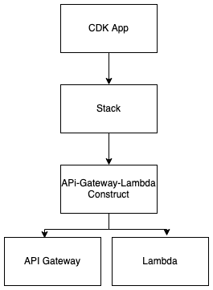

# AWS-CDK

Repository for the mini projects I've completed while learning the AWS CDK

### CDK Concepts

A CDK app contains Stacks which contain Constructs.
A Construct (represented as classes) contains resources to be provisioned e.g Lambda

<p align="center">
  
</p>

### CDK Commands

Populate AWS environment with resources

```
cdk bootstrap

```

Generate CloudFormation template

```
cdk sync
```

Deploy

```
cdk deploy
```
